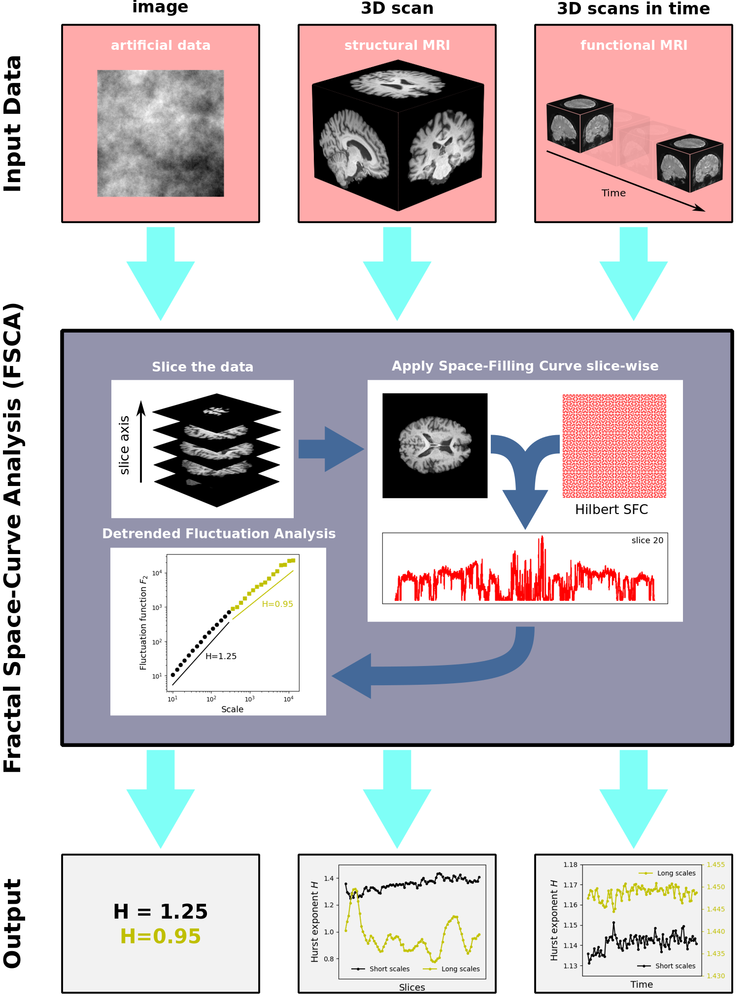

# Fractal Space-Curve Analysis (FSCA) package


Fractal Space-Curve Analysis is a method designed for the analysis of multidimensional data. FSCA combines the [Space-Filling Curve](https://en.wikipedia.org/wiki/Space-filling_curve) mapping for dimensionality reduction with the [Detrended Fluctuation Analysis](https://www.sciencedirect.com/science/article/pii/S0378437102013833) fractal analysis for interpretable results.
<p align="center">
  
</p>

<!--  -->

Method is suitable for diverse data formats with special submodule for neuroimaging data. An example of FSCA application to identification of Alzheimer's Disease:
<p align="center">
  
</p>

----

## Usage

### Apply FSCA to MRI scan

For an out-of-the-box analysis of a structural MRI scan:
```
import fsca
pipe = fsca.neuro.pipeline_mri()
pipe.run(scan_file = 'test-data/scanfile.nii.gz', slice_axis = 'z')
hurst_profile = pipe.get_result()
```
The outcome of FSCA is a Hurst profile measuring local fractal properties of the MRI scan along the `slice_axis` axis.

----

### FSCA for generic data structures
Method is applicable to most popular 2D, 3D and 4D structured data. Basic pipelines are:

- `pipeline_2d` : 2D data
- `pipeline_2x1d` : 2+1D  data (f.e. animation or video)
- `pipeline_3d`: 3D data (temperature grids)
- `pipeline_3x1d` 3+1D data (dynamical fields)

----

## Dedicated neuroimaging tools

### MRI preprocessing module
Package comes with a additional, ML-powered preprocessing module for MRI scans using the `ants` package. This module is especially useful for systematic analysis of unprocessed MRI scans. This module is integrated into a dedicated pipeline `fsca.neuro.pipeline_ext.pipeline_mri_preprocessing`:
```
from fsca.neuro.pipeline_ext import pipeline_mri_preprocessing
pipe = pipeline_mri_preprocessing()
pipe.run(scan_file = 'test-data/raw_scan.nii.gz', slice_axis = 'z')
hurst_profile = pipe.get_result()
```

----

## Requirements

* [MFDFA](https://github.com/mlaib/MFDFA)
* [nibabel](https://github.com/nipy/nibabel)
* [antspyx](https://github.com/ANTsX/ANTsPy) [not required, used by MRI preprocessing module]
* [antspynet](https://github.com/ANTsX/ANTsPyNet) [not required, used by MRI preprocessing module]
